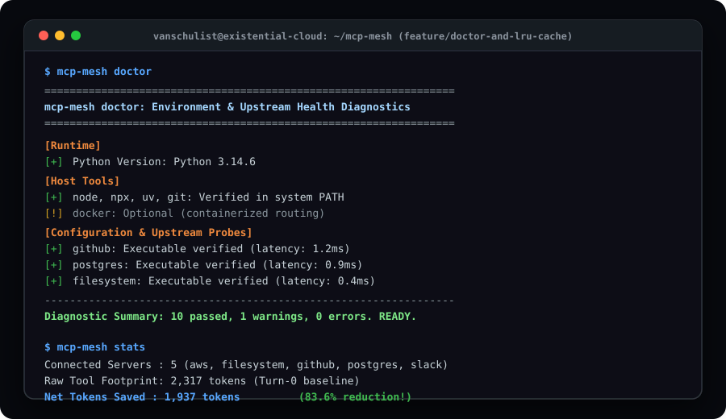

# 🌐 `mcp-mesh`

> **The Dynamic Model Context Protocol Gateway & Lazy Tool Router**  
> Aggregate 50+ upstream MCP servers, eliminate tool schema context bloat, and slash Turn-0 token consumption by 85–95% with zero external dependencies.

[](https://www.existentialcloud.ccwu.cc)
[](https://github.com/VanSchulist/mcp-mesh/releases/tag/v1.1.0)
[](https://github.com/VanSchulist/mcp-mesh/actions/workflows/ci.yml)
[](https://pypi.org/project/mcp-mesh/)
[](https://opensource.org/licenses/MIT)
[](https://www.python.org/downloads/)
[](#architecture)
[](https://modelcontextprotocol.io/)

<p align="center">
  
</p>

---

## 💡 Why `mcp-mesh`?

The **Model Context Protocol (MCP)** is revolutionizing how LLMs interface with databases, code repositories, and external APIs. However, as developers connect agents to multiple MCP servers (GitHub, Postgres, Slack, Memory, Filesystem, AWS), a severe bottleneck emerges:

1. **Turn-0 Token Bloat**: Connecting to 10 MCP servers injects **50 to 100+ full JSON schemas** into the system prompt before the user types a single word. This burns **15,000 to 40,000 tokens** per request.
2. **Context Window Degradation ("Lost in the Middle")**: Flooding the prompt with hundreds of parameter definitions degrades LLM attention, causing tool hallucinations, invalid parameter formatting, and dropped instructions.
3. **Subprocess Hell**: Managing dozens of discrete child processes across Cursor, Claude Desktop, and terminal agents leads to resource leaks and configuration fragility.

`mcp-mesh` solves this by acting as a **single, transparent MCP gateway**. Instead of exposing all 100 downstream schemas statically, it indexes your tools and exposes **lightweight meta-tools** (`mesh_search_tools`, `mesh_describe_tool`, `mesh_invoke_tool`).

Schemas are loaded lazily on demand. The result? **Turn-0 context overhead drops from 25,000+ tokens to ~380 tokens—an immediate ~90% cost and latency reduction.**

---

## ✨ Features

* 🚀 **Zero External Dependencies**: Engineered purely with Python 3.10+ standard library (`json`, `http.server`, `subprocess`, `argparse`, `sys`, `dataclasses`). Runs instantly anywhere without `pip install` friction.
* 🩺 **`mcp-mesh doctor`**: Built-in environment & health diagnostics engine inspecting host runtimes (`node`, `npx`, `uv`, `git`, `docker`), configuration syntax, and downstream binary availability with latency probes.
* 🌐 **Server-Sent Events (SSE) & HTTP Transport**: Run `mcp-mesh sse` as a shared team gateway daemon or Docker container for remote agents and cloud IDEs.
* ⚡ **Dynamic LRU Hot-Tier Schema Cache**: In-memory cache keeps frequently-accessed tool schemas primed for instant multi-turn retrieval with zero lookup overhead.
* 🔍 **Semantic Keyword Tool Indexer**: Sub-millisecond inverted index with BM25-style keyword and parameter matching across all aggregated upstream servers.
* ⚡ **Lazy Schema Loading**: Exposes ultra-compact tool signatures (15–30 tokens) during discovery, loading full JSON schemas only when explicitly inspected or invoked.
* 🔄 **Transparent Stdio Multiplexing**: Connects to your MCP client (Claude Desktop, Cursor, Antigravity, Cline) as a single standard stdio server while supervising downstream child processes.
* 🛡️ **Direct Invocation Fallback**: Automatically resolves direct tool invocations (e.g. `query_readonly` or `postgres::query_readonly`) even if the agent bypasses the meta-tool wrapper.
* 📊 **Built-in Token Economy Meter**: CLI diagnostic tools to inspect aggregated servers, measure Turn-0 token footprints, and verify net token savings.

---

## 🏛️ Architecture

```text
 ┌────────────────────────────────────────────────────────┐
 │                    AI Client / IDE                     │
 │          (Claude Desktop, Cursor, Antigravity)         │
 └───────────────────────────┬────────────────────────────┘
                             │ stdio (JSON-RPC 2.0)
                             │ Only 3-4 Meta-Tools Exposed (~380 tokens)
                             ▼
 ┌────────────────────────────────────────────────────────┐
 │                   mcp-mesh Gateway                     │
 │  ┌──────────────────────────────────────────────────┐  │
 │  │      JSON-RPC 2.0 Parser & Stdio Transport       │  │
 │  └────────────────────────┬─────────────────────────┘  │
 │                           ▼                            │
 │  ┌──────────────────────────────────────────────────┐  │
 │  │        Tool Indexer & Token Economy Meter        │  │
 │  │      (BM25 Scoring, Signatures, Token Stats)     │  │
 │  └────────────────────────┬─────────────────────────┘  │
 │                           ▼                            │
 │  ┌──────────────────────────────────────────────────┐  │
 │  │    Process Multiplexer & Upstream Stdio Router   │  │
 │  └────────────────────────┬─────────────────────────┘  │
 └───────────────────────────┼────────────────────────────┘
                             │
         ┌───────────────────┼───────────────────┐
         ▼ stdio             ▼ stdio             ▼ stdio
 ┌───────────────┐   ┌───────────────┐   ┌───────────────┐
 │ GitHub MCP    │   │ Postgres MCP  │   │ Filesystem    │
 │ (35+ tools)   │   │ (15+ tools)   │   │ (12+ tools)   │
 └───────────────┘   └───────────────┘   └───────────────┘
```

---

## ⚡ Quick Start (5 Minutes)

### Option A: Install from PyPI or Run with UV (Zero Install)
```bash
# Direct install from PyPI
pip install mcp-mesh

# Or execute instantly with zero installation via uvx:
uvx mcp-mesh demo
```

### Option B: Clone & Run from Source (Zero External Dependencies)
```bash
git clone https://github.com/VanSchulist/mcp-mesh.git
cd mcp-mesh

# Run the interactive demo and token savings meter
python main.py demo
```

You will see the live economy report:
```text
=================================================================
  mcp-mesh: Dynamic MCP Gateway & Lazy Tool Router (v1.1.0)
  Engineered by Van Schulist (@VanSchulist / Existential Cloud)
=================================================================

[+] AGGREGATION & TOKEN ECONOMY REPORT:
  Connected Servers  : 5
  Server IDs         : aws, filesystem, github, postgres, slack
  Total Tools        : 12
-----------------------------------------------------------------
  Raw Schema Tokens  : 2317 tokens (Turn-0 baseline)
  mcp-mesh Overhead  : 380 tokens (Meta-tool signatures)
  Net Tokens Saved   : 1937 tokens
  Efficiency Gain    : 83.6% token reduction!
=================================================================
```

---

## 🛠️ Configuration & Client Setup

### Claude Desktop / Cursor / Antigravity Integration
Configure `mcp-mesh` as your single master MCP server in your `claude_desktop_config.json` or Cursor MCP settings:

```json
{
  "mcpServers": {
    "mcp-mesh": {
      "command": "mcp-mesh",
      "args": ["run", "--config", "/path/to/mcp_mesh_config.json"]
    }
  }
}
```

### Gateway Configuration (`mcp_mesh_config.json`)
> **Tip**: Instead of hand-writing this JSON configuration, use our companion package manager [`mcp-registry-cli`](https://github.com/VanSchulist/mcp-registry-cli) to auto-configure tools:
> ```bash
> uvx mcp-registry-cli add postgres github brave-search
> ```

List all your downstream MCP servers in standard JSON format:

```json
{
  "mcpServers": {
    "github": {
      "command": "npx",
      "args": ["-y", "@modelcontextprotocol/server-github"],
      "env": {
        "GITHUB_PERSONAL_ACCESS_TOKEN": "ghp_xxxxxxxxxxxx"
      }
    },
    "postgres": {
      "command": "npx",
      "args": ["-y", "@modelcontextprotocol/server-postgres", "postgresql://localhost/mydb"]
    },
    "filesystem": {
      "command": "npx",
      "args": ["-y", "@modelcontextprotocol/server-filesystem", "/workspace"]
    }
  }
}
```

---

## 💻 CLI Commands

`mcp-mesh` includes an ergonomic CLI for diagnostics, remote daemon streaming, and discovery:

```bash
# 1. Environment & Upstream Health Check (flutter-doctor style diagnostics)
mcp-mesh doctor
# Or diagnose a specific configuration file:
mcp-mesh doctor --config mcp_mesh_config.json

# 2. Start HTTP/SSE gateway daemon for remote or containerized agents
mcp-mesh sse --port 8000 --host 0.0.0.0

# 3. Start standard MCP stdio proxy gateway for Claude / Cursor / Antigravity
mcp-mesh run --config mcp_mesh_config.json

# 4. View token savings and server aggregation stats
mcp-mesh stats

# 5. Test natural language tool search from terminal
mcp-mesh search "commit code and create pull request"

# 6. Inspect full JSON schema for an indexed tool
mcp-mesh inspect github::create_pull_request

# 7. Run zero-config demonstration suite
mcp-mesh demo
```

---

## 🧪 Testing

The repository maintains a comprehensive automated test suite testing the JSON-RPC engine, keyword indexer, dynamic LRU cache, health doctor, SSE transport, and gateway protocol:

```bash
# Run all unit tests
python -m unittest discover -s tests -v
```

All 36+ tests execute synchronously using standard library `unittest` with zero setup.

---

## 🗺️ Roadmap & Ecosystem

`mcp-mesh` serves as the **Flagship Project** of the [Existential Cloud AI Studio](https://github.com/VanSchulist/github-ai-studio).

* [x] **Phase 1: Core Engine (v1.0.0 & v1.1.0)** - Zero-dependency stdio proxy, token indexer, dynamic LRU schema cache, `mcp-mesh doctor`, and SSE remote transport.
* [x] **Phase 2: `mcp-mesh-eval` (Satellite 1)** - Frontier benchmark harness evaluating 60 tools across September 2026 models ([Repo](https://github.com/VanSchulist/mcp-mesh-eval)).
* [x] **Phase 3: `mcp-mesh monitor` (Satellite 2)** - Real-time terminal telemetry monitor (`mcp-mesh monitor`) streaming live tool invocations and latency.
* [x] **Phase 4: `mcp-registry-cli` (Satellite 3)** - Zero-config community package manager discovering and auto-installing MCP servers directly into `mcp-mesh` ([Repo](https://github.com/VanSchulist/mcp-registry-cli)).

---

## 🤝 Contributing

Contributions, feedback, and issue reports are warmly welcomed:

1. Fork the repository.
2. Create your feature branch (`git checkout -b feature/dynamic-lru-cache`).
3. Commit your changes with semantic commit messages (`git commit -m 'feat: add LRU cache for active schemas'`).
4. Ensure all tests pass (`python -m unittest discover -s tests`).
5. Open a Pull Request.

---

## 📄 License

Distributed under the **MIT License**. See [`LICENSE`](LICENSE) for complete details.

---

**Crafted with 🖤 by [Van Schulist](https://github.com/VanSchulist) | [Existential Cloud](https://github.com/VanSchulist/github-ai-studio)**
